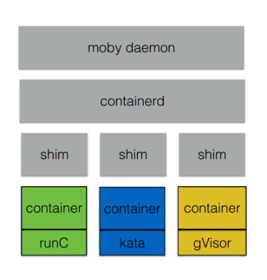

## 0. 云原生简介

### 云原生技术发展简史

- 2004 年— 2007 年，Google 已在内部大规模地使用像 Cgroups 这样的容器技术；

- 2008 年，Google 将 Cgroups 合并进入了 Linux 内核主干；

- 2013 年，Docker 项目正式发布；

- 2014 年，Kubernetes 项目也正式发布。这样的原因也非常容易理解，因为有了容器和 Docker 之后，就需要有一种方式去帮助大家方便、快速、优雅地管理这些容器，这就是 Kubernetes 项目的初衷。在 Google 和 Redhat 发布了 Kubernetes 之后，这个项目的发展速度非常之快；

- 2015 年，由Google、Redhat 以及微软等大型云计算厂商以及一些开源公司共同牵头成立了 CNCF 云原生基金会。CNCF 成立之初，就有 22 个创始会员，而且 Kubernetes 也成为了 CNCF 托管的第一个开源项目。在这之后，CNCF 的发展速度非常迅猛；

- 2017 年，CNCF 达到 170 个成员和 14 个基金项目；

- 2018 年，CNCF 成立三周年有了 195 个成员，19 个基金会项目和 11 个孵化项目，如此之快的发展速度在整个云计算领域都是非常罕见的。

  

### 云原生的技术范畴

------

- **云应用定义与开发流程**，这包括应用定义与镜像制作、配置 CI/CD、消息和 Streaming 以及数据库等；
- **云应用的编排与管理流程**，这也是 Kubernetes 比较关注的一部分，包括了应用编排与调度、服务发现治理、远程调用、API 网关以及 Service Mesh；
- **监控与可观测性**，这部分所强调的是云上应用如何进行监控、日志收集、Tracing 以及在云上如何实现破坏性测试，也就是混沌工程的概念；
- **云原生的底层技术**，比如容器运行时、云原生存储技术、云原生网络技术等；
- **云原生工具集**，在前面的这些核心技术点之上，还有很多配套的生态或者周边的工具需要使用，比如流程自动化与配置管理、容器镜像仓库、云原生安全技术以及云端密码管理等；
- **Serverless**，Serverless 是一种 PaaS 的特殊形态，它定义了一种更为“极端抽象”的应用编写方式，包含了 FaaS 和 BaaS 这样的概念。而无论是 FaaS 还是 BaaS，其最为典型的特点就是按实际使用计费（Pay as you go），因此 Serverless 计费也是重要的知识和概念。

### 云原生的两个理论

- **不可变基础设施**，这一点目前是通过容器镜像来实现的，其含义就是应用的基础设施应该是不可变的，是一个自包含、自描述可以完全在不同环境中迁移的东西；
- **云应用编排理论**，当前的实现方式就是 Google 所提出来的【容器设计模式】，这也是本系列课程中的 Kubernetes 部分所需主要讲解的内容。

**云时代的基础设施就像是可以替代的【牲口】，可以随时替换；而传统的基础设施则是独一无二的【宠物】，需要细心呵护；这就体现了云时代不可变基础设施的优点。**


## 1. 容器与镜像

### 容器

------


ps操作可以看到进程，这些进程包括系统自带的服务和用户的应用程序，它们的特点：
 * 这些进程可以相互看到、相互通信；
 * 它们使用的是同一个文件系统，可以对同一个文件进行读写操作；
 * 这些进程会使用相同的系统资源。

这些特点会带来一些问题： 

* 因为这些进程能够相互看到并且进行通信，高级权限的进程可以攻击其他进程；
* 因为它们使用的是同一个文件系统，因此会带来两个问题：
  * 这些进程可以对已有的数据进行增删改查，具有高级权限的进程可能会将其他进程的数据删除掉，破坏其他进程的正常运行；
  * 进程与进程之间的信赖可能会存在冲突，如此一来就会给运维带来很大的压力；
* 因为这些进程使用的是同一个宿主机的资源，应用之间可能会存在资源抢占的问题，当一个应用需要消耗大量CPU和内存资源的时候，就可能会破坏其他应用的运行，导致其他应用无法正常地提供服务。

针对上面的问题：

* 针对不同进程使用同一个文件系统所造成的问题而言，Linux和Unix操作系统可以通过chroot系统调用将子目录变成根目录，达到视图级别的隔离；进程在chroot的帮助下可以具有独立的文件系统，对于这样的文件系统进行增删改查不会影响其他进程；
* 因为进程之间相互可见并且可以相互通信，使用Namespace技术来实现进程在资源的视图上进行隔离，在chroot和Namespace的帮助下，进程就能够运行在一个独立的环境下了；
* 但在独立的环境下，进程所使用的还是同一个操作系统的资源，一些进程可能会侵蚀掉整个系统的资源，为了减少进程彼此之间的影响，可能通过Cgroup来限制其他资源使用率，设置其他能够使用的CPU以及内存量。

**容器就是一个视图隔离、资源可限制、独立文件系统的进程集合。**

* **视图隔离**，能够看到部分进程以及具有独立的主机名；
* **控制资源使用率**，控制内存大小和CPU使用个数；
* **进程集合**，将系统的其他资源隔离开来，具有自己独立的资源视图；
* **独立文件系统**，因为使用的是系统的资源，所以在独立的文件系统内不需要具备内核相关的代码或者工具，我们只需要提供容器所需的二进制文件、配置文件以及依赖即可，只要容器运行时所需的文件集合都能够具备，那么这个容器就能够运行起来。

**镜像：容器运行时所需要的所有的文件集合。**

```
通常情况下，采用Dockerfile来构建镜像。Dockerfile提供了非常便利的语法糖，能够帮助我们很好地描述构建的每个步骤。
每个步骤都会对已有的文件系统进行操作，这样就会带来文件系统内容的变化，这些变化称为 【changeset】。当把构建步骤所产生的变化依次作用到一个空文件夹上，就得到一个完整的镜像。
```

changeset的分层以及复用特点能够带来几点优势：

* **提高分发效率**，净大镜像拆分成小镜像之后可以并行下载这些数据；
* **只需要下载本地没有的数据即可**；
* **镜像共享，节约磁盘空间**；

### Dockerfile

------

```
# base on golang:1.12-alpine image
FROM golang:1.12-alpine

# setting current working dir (PWD -> /go/src/app)
WORKDIR /go/src/app

# copy local files into /go/src/app
COPY . .

# get all the dependencies
RUN go get -d -v ./...


# build the application and install it
RUN go install -v ./...

# by default, run the app
CMD ["app"]
```

1. **FROM **表示以下的构建步骤基于什么镜像；
2. **WORKDIR **表示会把接下来的构建步骤都在哪一个具体目录下进行，其起到的作用类似于shell里的cd；
3. **COPY **表示可以将宿主机上的文件拷贝到容器镜像内；
4. **RUN** 表示在具体的文件系统内执行相应操作，执行完毕就得到一个应用；
5. **CMD **表示使用镜像时的默认程序名字；

有了Dockerfile之后，就可以通过 **docker build** 命令构建出所需要的应用。

**Docker registry**

```
镜像仓库，存储镜像。
docker pull app:v1
docker push app:v1
```

**运行容器**

1. 从镜像仓库拉取镜像，可通过docker images查看拉取的镜像；

2. docker run [-d] -name demo busybox:1.25 top; 一个镜像相当于一个模板，一个容器就像是一个具体运行实例(Build once, Run anywhere)。

   

### 容器的生命周期

------

**单进程模型**

* Init进程=容器生命周期；
* 运行期间可执行 exec 执行运维操作；

**数据持久化**

* 独立于容器的生命周期；
* 数据卷 - docker volumes vs bind;
  * bind，直接将宿主机的目录挂载到容器内，运维成本较高，因为其依赖于宿主机的目录，需要对于所有的宿主机进行统一管理；
  * 将目录管理交给运行引擎。


### 容器项目架构

------

**moby 容器引擎架构**

```
moby是目前最流行的容器管理引擎，moby daemon 会对上提供有关容器、镜像、网络以及Volume的管理。moby daemon所依赖的最重要的组件就是containerd，containerd是一个容器运行时管理引擎，其独立于moby daemon，可以对上提供容器、镜像的相关管理。
containerd底层有containerd shim模块，其类似于一个守护进程，这样设计的原因有几点：
	首先，containerd 需要管理容器生命周期，而容器可能是由不同的容器运行时所创建出来的，因此需要提供一个灵活的插件化管理。而 shim 就是针对于不同的容器运行时所开发的，这样就能够从 containerd 中脱离出来，通过插件的形式进行管理。
	其次，因为 shim 插件化的实现，使其能够被 containerd 动态接管。如果不具备这样的能力，当 moby daemon 或者 containerd daemon 意外退出的时候，容器就没人管理了，那么它也会随之消失、退出，这样就会影响到应用的运行。
	最后，因为随时可能会对 moby 或者 containerd 进行升级，如果不提供 shim 机制，那么就无法做到原地升级，也无法做到不影响业务的升级，因此 containerd shim 非常重要，它实现了动态接管的能力。
```



**containerd**

* 容器运行时管理引擎，独立于moby daemon；
* containerd-shim 管理容器生命周期，可被containerd动态接管；

**容器运行时**

* 容器虚拟化技术方案；
* runC kata gVisor


### 容器 vs VM

------


* VM复用Hypervisor虚拟化技术模拟CPU、内存等硬件资源，就样这可以在宿主机上建立一个Guest OS，每一个Guest OS都有一个独立的内核，比如Ubuntu、CentOS等；
* 容器是针对进程的，无需Guest OS，只需要一个独立的文件系统提供其所需的文件集合即可；
* 容器启动时间习快于VM，所需磁盘空间小于VM，但是隔离效果要比VM差很多；
* 管理VM=管理基础设施；管理容器=直接管理应用本身(容器也是一个进程)；
* **容器之间是被Linux Namespace和cgroups隔离开**。


## 2. 组件介绍

**k8s架构**


* APIServer: **所有服务访问统一入口，并提供认证、授权、访问控制、API注册和发现等机制**；

  所有组件相互之间不直接通信，而是通过ApiServer通信；

  

* Controller-Manager: 维护集群的状态，比如故障检测、自动扩展、滚动更新等；**只有一个Active,可热备**

* Scheduler: 负责资源的调度，按照预定的调度策略将Pod调度到相应的机器上；**只有一个Active,可热备**

* Etcd: 键值对数据库，储存K8s集群所有重要信息(持久化)，保存了整个集群的状态；

* Kubelet: **直接跟容器引擎交互，实现容器的生命周期管理**；同时也负责Volume(CVI)和网络(CNI)的管理;

* Container runtime: 负责镜像管理以及Pod和容器的真正运行(CRI);

* kube-proxy: 负责写入规则至Iptables(IPVS)，实现服务映射访问（为service提供cluster内部的服务发现和负载均衡）；

* CoreDNS：可以为集群中的svc创建一个域名IP的对应关系解析；

* DashBoard: k8s B/S结构访问体系；

* Ingress Controller: 官方只能实现四层代理，Ingress可以实现七层代理；

* Federation: 提供一个可以跨集群中心多K8s统一管理功能；

* Prometheus: 提供k8s集群监控能力；

* EFK: 提供K8S集群日志统一分析接入平台；


## 3. 基础概念

```
Kubernetes就是云时代的【操作系统】，容器=【进程】(Linux线程)，Pod=【进程组】(Linux线程组)，容器镜像就是：这个操作系统的【软件安装包】。
```

### Namespace

```
namespace是对一组资源和对象的抽象集合，比如可以用来将系统内部的对象划分为不同的项目组或用户组。常见的pods, services, replication controllers和deployments等都是属于某一个namespace的(默认是default)，而node, persistentVolumes等则不属于任何namespace。
```

### Label

```
Label是识别kubernetes对象的标签，以key/value的方式附加到对象上。Label定义好后其他对象可以使用Label Selector来选择一组相同label的对象(比如ReplicaSet和Service用label来选择一组Pod)，Label Selector支持以下几种方式：
 * 等式，如 app=nginx 和 env!=production
 * 集合，如 env in (production, qa)
 * 多个label(它们之间是AND关系)，如 app=nginx, env=test
```

### Annotations

```
Annotations是key/value形式附加于对象的注解。不同于Labels用于标志和选择对象，Annotations则是用来记录一些附加信息，用来辅助应用部署、安全策略以及调度策略等。比如deployment使用annotations来记录rolling update的状态。
```

### pod


#### 为什么需要Pod

**来自Google Borg的思考**

```
Google工程师发现，在Borg项目部署的应用，往往都存在着类似于【进程和进程组】的关系，更具体的说，就是这些应用之间有着密切的协作关系，便利它们必须部署在同一台机器上并且共享某些信息。
```

#### 为什么Pod必须是原子调度单位


#### 再次理解Pod


#### Pod的实现机制

**Pod要解决的问题**

* pod内部多个容器之间最高效的共享某些资源和数据；

  容器间原本是被Linux Namespace和cgroups隔离开的。

  * 共享网络

    

  1. 多个容器通过Infra Container（pause）的方式共享同一个Network Namespace;
  2. 不同容器之间直接使用localhost进行通信；
  3. 不同容器看到的网络设备跟Infra容器看到的完全一样；
  4. 一个Pod只有一个IP地址，也就是这个pod的network namespace对应的IP地址；
  5. 整个Pod的生命周期跟Infra容器一致，而与容器A和B无头。

  

  * 共享存储

    ```
    apiVersion: v1
    kind: Pod
      name: two-containers
    spec:
      restartPolicy: Never
      volumes:
      - name: shared-data # shared-data对应在宿主机上的目录，会被同时绑定挂载进两个容器当中
        hostPath:
          path: /data 
      containers:
      - name: nginx-container
        image: nginx
        volumeMounts:
        - name: shared-data
          mountPath: /usr/share/nginx/html
      - name: debian-container
        image: debian
        volumeMounts:
        - name: shared-data
          mountPath: /pod-data
        command: ["/bin/sh"]
        args: ["-c", "echo Hello from the debian container > /pod-data/index.html"]
      
    ```

    

  * 容器设计模式: Sidecar，将辅助功能同主业务容器解耦，实现独立发布和能力重用。

    ```
    apiVersion: v1
    kind: Pod
    metadata:
      name: javaweb-2
    spec:
      initContainer:
      - image: resource/sample:v2
        name:war
        command: ["cp", "/sample.war", "/app"]
        volumeMounts:
        - mountPath: /app
          name: app-volume
      containers:
      - image: resource/tomcat:7.0
        name: tomcat
        command: ["sh", "-c", "/root/apache-tomcat-7.0.43-v2/bin/start.sh"]
        volumeMounts:
        - mountPath: /root/apache-tomcat-7.0.42-v2/webapps
          name: app-volume
        ports:
        - containerPort: 8080
          hostPort: 8001
      volumes:
      - name: app-volume
        emptyDir: {}
    ```

    1. Init Container会比spec.containers先启动；
    2. /app 是一个volume；
    3. Tomcat容器，同样声明了挂载该volume到自己的webapps下；
    4. 故当Tomcat容器启动时，它的webapps目录下就一定会存在sample.war文件。


### ReplicaSet(RS)

```
用来确保容器应用的副本数始终保持在用户定义的副本数，即如果有容器异常退出，会自动创建新的Pod来替代；而如果异常多出来的容器也会自动回收。支持集合式的selector。
```

* 一般使用Deployment自动管理RS(RS不支持rolling-update，但Deployment支持)

### Deployment 

```
为Pod和RS提供了一个声明式定义(declarative)方法。典型应用场景如下：
 * 定义Deployment来创建Pod和RS；
 * 滚动升级和回滚应用；
 * 扩容和缩容；
 * 暂停和继续Deployment;
```


* Deployment负责管理不同版本的ReplicaSet, 由ReplicaSet管理Pod副本数；
* 每个ReplicaSet对应了Deployment template的一个版本；
* 一个ReplicaSet下的Pod是相同版本。

**HPA**

```
在V1版本中仅支持根据Pod的CPU利用率缩容，在v1alpha版本中，支持根据内存和用户自定义的metric扩缩容。
```

### StatefulSet

```
为了解决有状态服务的问题(对应Deployment和RS是为无状态服务而设计的),其应用场景如下：
 * 稳定的持久化网络：即Pod重新调度后还是能访问到相同的持久化数据，基于PVC来实现；
 * 稳定的网络标志：即Pod重新调度后其PodName和HostName不变；
 * 有序部署，有序扩展：即Pod是有顺序的，在部署或者扩展的时候要依据定义的顺序依次进行，基于initC实现；
 * 有序收缩，有序删除；
```

### DaemonSet

```
确保全部(或一些)Node上运行一个Pod的副本，当有Node加入集群时，也会为他们新增一个Pod；当有Node从集群移除时，这些Pod也会被回收。删除DaemonSet将会删除它创建的所有Pod。典型用法如下：
 * 运行集群存储daemon，例如在每个Node上运行 glusterd、ceph；
 * 在每个Node上运行日志收集daemon，例如fluentd、logstash；
 * 在每个Node上运行监控daemon，例如Prometheus Node Exporter；
```

### Job CronJob

```
Job负责批处理任务，即仅执行一次的任务，它保证批处理任务的一个或多个Pod成功结束；
Cron Job管理基于时间的Job,即：
 * 在给定的时间点只运行一次；
 * 周期性地在给定时间点运行；
```

### 网络通讯方式

* 同一个Pod内的多个容器之间： localhost

* 各Pod之间的通讯： Overlay Network；

  1）Pod1与Pod2在同一台机器，由**docker0**网桥直接转发请求至Pod2，不需要经过flannel；

  2）Pod1与Pod2不在同一台主机，通过宿主机的**物理网卡**进行**。**将Pod的IP和所在Node的IP关联起来，通过这个关联让Pod可以互相访问；

* Pod与Service之间的通讯：**各节点的Iptables(IPVS)规则**；

  ```
  Flannel是CoreOS团队针对Kubernetes设计的一个网络规划服务，简单来说，它的功能是让集群中的不同节点主机创建的Docker容器都具有【全集群唯一的虚拟IP地址】。而且它还能在这些IP之间建立一个覆盖网络(Overlay Network)，通过这个覆盖网络，将数据包原封不动地传递到目标容器内。
  Etcd之Flannel提供说明：
   * 存储管理Flannel可分配的IP地址段资源；
   * 监控Etcd中每个Pod的实际地址，并在内存中建立维护Pod节点路由表；
  ```

  

## 4.资源清单

```
k8s中所有的内容都抽象为资源，资源实例化之后，叫做对象。一般使用yaml格式的文件来创建符合我们期望的Pod，这样的yaml文件称为资源清单。
```

### Pod生命周期


```
Pod能够具有多个容器，应用运行在容器里面，但是它也可能有一个或多个先于应用容器启动的 Init容器：
 * InitC总是运行到成功完成为止；
 * 每个InitC都必须在下一个InitC启动之前成功完成；
如果Pod的InitC失败，k8s为不断地重启该Pod，直到InitC成功为止，如果Pod对应的restartPolicy为Never，它不会重新启动。
因为InitC具有与应用容器分离的单独镜像，所以它们的启动相关代码具有如下优势：
 * InitC使用Linux Namespace，所以【相对应用程序容器来说具有不同的文件系统视图】。因此，它们具有访问Secret的权限，而应用程序容器则不能；
 * 它们必须在应用程序启动之前运行完成，而应用程序容器是并行运行的，所以InitC能够提供一种简单的阻塞或延迟应用容器启动的方法，直到满足一组先决条件；
 * 在Pod启动过程中，InitC会按顺序在网络和数据卷初始化之后启动。每个容器必须在下一个容器启动之前成功退出；
 * 如果由于运行时失败退出，将导致容器启动失败，它会根据Pod的restartPolicy指定的策略进行重试；即如果Pod的restartPolicy设置为Always，InitC失败时会使用RestartPolicy策略；
 * 在所有的InitC没有成功之前，Pod将不会变成Ready状态。InitC的端口将不会在Service中进行聚集，正在初始化中的Pod处于Pending状态，但应该会将Initializing状态设置为true；
 * 如果Pod重启，所有InitC必须重新执行；
 * 对InitC spec的修改被限制在容器Image字段，修改其他字段都不会生效。更改initC的image字段，等价于重启该Pod；
 * InitC具有应用容器的所有字段，除了redinessProbe，因为InitC无法定义不同于完成(completion)的就绪(rediness)之外的其他状态。这会在验证过程中强制执行；
 * 在Pod中的每个app和initC的名称必须唯一；与任何其它容器共享同一个名称，会在验证时抛出错误；

```

### 容器探针

```
探针是由kubelet对容器执行的定期诊断，要执行诊断，kubelet调用由容器实现的Handler。有三种类型的处理程序：
 * ExecAction: 在容器内执行指定命令，如果命令退出时返回码为0则认为诊断成功；
 * TCPSocketAction: 对指定端口上的容器的IP地址进行TCP检查，如果端口打开，则诊断被认为是成功的；
 * HTTPGetAction: 对指定的端口和路径上的容器IP地址执行HTTP Get请求，如果响应的状态码大于等于200且小于400,则诊断被认为是成功的；
每次探测都将获得以下三种结果之一：
 * 成功：容器通过了诊断；
 * 失败：容器未通过诊断；
 * 未知：诊断失败，因此不会采取任何行动；
探测方式：
 * livenessProbe: 指示容器是否正在运行；如果存活探测失败，则kubelet会杀死容器，并且容器将受到其重启策略的影响；如果容器不提供存活探针，则默认状态为Success；
 * readinessProbe: 指示容器是否准备好服务请求；如果就绪探测失败，端点控制器将从与Pod匹配的所有Service的端点中删除该Pod的IP地址；初始延迟之前的就绪状态默认为Failure。如果容器不提供就绪探针，则默认状态为Success。
```

### Pod hook

```
Pod hook(钩子)是由k8s管理的Kubelet发起的，当容器中的进程启动前或者容器中的进程终止之前运行，这是包含在容器的生命周期之中。可以同时为Pod中的所有容器都配置hook。Hook的类型包括两种：
 * exec: 执行一段命令；
 * HTTP: 发送HTTP请求；
```

### restartPolicy

```
PodSpec中有一个restartPolicy字段，可能的值为Always、OnFailure、Never。默认为Always。restartPolicy适用于Pod中的所有容器，restartPolicy仅指通过同一节点上的kubelet重新启动容器。失败的容器由kubelet以五分钟为上限的指数退避延迟(10秒，20秒，40秒。。。)重新启动，并在成功执行10分钟后重置。如Pod文档中所述，一旦绑定到一个节点，Pod将永远不会重新绑定到另一个节点。
```

### status

* Pending: Pod已被k8s系统接受，但有一个或多个容器镜像尚未创建，等待时间包括调度Pod的时间和通过网络下载镜像的时间；
* Running: 该Pod已经绑定到了一个节点上，Pod中所有的容器都已被创建，至少有一个容器正在运行，或者正处于启动或重启状态；
* Successed: Pod中的所有容器都被成功终止，并且不会再重启；
* Failed: Pod中的所有容器都已终止了，并且至少有一个容器是因为失败终止。也就是说，容器以非0状态退出或者被系统终止；
* Unknown: 因为某些原因无法取得Pod的状态，通常是因为与Pod所在主机通信失败；

### 资源清单格式

------

```
apiVersion: group/apiverison  # 如果没有给定group名称，那么默认为core，可以使用kubectl api-versions获取当前k8s版本上								所有的apiVersion版本信息(每个版本可能不同)
kind: Pod    # 资源类型，Pod, Deployment, Service ...
metadata:    # 资源元数据
  name: mypod
  namespace: default
  labels: my-pod
  annotations # 主要目的是方便用户阅读查找
spec:  # 期望的状态
status: # 当前状态，本字段由k8s自身维护，用户不能去定义
```

**资源清单的常用命令**

```
kubectl api-versions
kubectl explain pod
kubectl explain Ingress
```

**CMD、ENTRYPOINT、command、args**

CMD、ENTRYPOINT是在dockerfile中定义的，command、args中k8s命令。

* CMD

  ```
  容器启动以后，【默认】执行的命令，即如果docker run没有指定任何的执行命令或者dockerfile里面也没有entrypoint，那么，就会使用CMD指定的默认的执行命令执行，一个Dockerfile至多有一个CMD，用法：
    1. 【推荐】，带有[]，这时命令没有在任何shell终端环境下，如果要执行shell，必须把shell加入到[]参数中；
       FROM centos
       CMD ["/bin/bash", "-c", "echo 'hello cmd!'"]
    2. 没有[]，命令默认在"/bin/sh -c"下执行，
       FROM centos
       CMD echo "hello cmd!"
       
       运行：
         docker run 7db28cb11055
         hello cmd!
  以上体现了CMD的【默认】行为，如果在run时指定了命令或者entrypoint，那么CMD就会被覆盖。
  ```

* ENTRYPOINT

  ```
  定义容器启动以后的执行体，用法：
    1. 【推荐】，带[]，和CMD形式一致，如果run后面有东西，那么后面的全部都会作为entrypoint的参数，如果run后面没有，CMD后面有，那么CMD的全部内容会作为ENTRYPOINT的参数；
      FROM centos
      CMD ["p in cmd"]
      ENTRYPOINT ["echo"]
      运行：
       => docker run cfcc
       p in cmd 
       
       => docker run p in run
       p in run
    2. 无[]，任何run和cmd的参数都无法被传入到entrypoint里。
  ```

* command & args

  ```
  如果在容器配置中没有设置command或者args，那么将使用docker镜像自带的命令及其参数；
  如果在容器配置中只设置了command，没有设置args，那么容器启动时只会执行该命令，docker镜像中自带的命令及其入参会被忽略；
  如果在容器配置中只设置了args，那么docker镜像中自带的命令会使用该新入参作为其执行的入参；
  如果在容器配置中同时设置了command与args，那么docker镜像中自带的命令及其入参会被忽略。
  ```

  ```
  spec:
    containers:
      - name: ng1
        image: ng1
        command: [ "/bin/sh","-c" ] #运行的命令
        args: [ "echo '222'>/222.txt;sleep 30" ] #命令的参数，进入容器内查看
  ```

  ```
  kubectl exec -it pod-name -- /bin/bash
  ls
      222.txt
  ```

  

**通过定义清单文件创建Pod**

```
apiVersion: v1
kind: Pod
metadata:
  name: pod-demo
  namespace: default
  labels:
    app: myapp
spec: # 期望的状态(未必达到)，status：实际的状态
  containers:
  - name: myapp-1
    image: wangyanglinux/myapp:v1
  - name: busybox-1
    image: busybox:latest
    command:
    - "/bin/sh"
    - "-c"
    - "sleep 3600"
```

```
# 使用 -o 参数加 yaml，可以将资源的配置以yaml的格式输出出来，也可以使用json,输出json格式
kubectl get pod xx.xx.xx -o yaml
```

**Init容器**

init模板

```
apiVersion: v1
kind: Pod
metadata:
  name: myapp-pod
  labels:
    app: myapp
spec:
  containers:
  - name: myapp-container
    image: busybox
    command: ['sh', '-c', 'echo The app is running! > 111.txt && sleep 3600']
  initContainers:
  - name: init-myservice
    image: busybox
    command: ['sh', '-c', 'until nslookup  myservice; do echo waiting for myservice; sleep 2; done;']
  - name: init-mydb
    image: busybox
    command: ['sh', '-c', 'until nslookup mydb; do echo waiting for mydb; sleep 2; done;']
```

```
kind: Service
apiVersion: v1
metadata:
  name: myservice
spec:
  ports:
    - protocol: TCP
      port: 80
      targetPort: 9376
---
kind: Service
apiVersion: v1
metadata:
  name: mydb
spec:
  ports:
    - protocol: TCP
      port: 80
      targetPort: 9377
```

**检测探针 - 就绪检测**

```
readinessProbe主要探测服务是否就绪，如果你的应用的readinessProbe运行失败，那么就会从组成service的端点中删除，就样就不会有流量通过kubernetes服务发现机制来发送给它。
livenessProbe探测服务是否可用，不可用时重启pod。
```

redinessProbe-httpget

```
apiVersion: v1
kind: Pod
metadata:
  name: rediness-httpget-pod
  namespace: default
spec:
  containers:
  - name: readiness-httpget-container
    image: wangyanglinux/myapp:v1
    imagePullPolicy: IfNotPresent
    readinessProbe:
      httpGet:
        port: 80
        path: /index1.html
      initialDelaySeconds: 1   # 容器启动后，第一次执行探测需要等待多少秒
      periodSeconds: 3         # 执行探测的频率，默认是10s，最小1s
                               # timeoutSeconds，探测超时时间，告诉k8s应该为健康检查等待多长时间，默认1s，最小1s
```

**检测探针 - 存活检测**

livenessProbe-exec

```
apiVersion: v1
kind: Pod
metadata:
  name: liveness-exec-pod
  namespace: default
spec:
  containers:
  - name: liveness-exec-container
    image: wangyanglinux/myapp:v1
    imagePullPolicy: IfNotPresent
    command: ["/bin/sh", "-c", "touch /tmp/live ; sleep 60; rm -rf /tmp/live; sleep 3600"]
    livenessProbe:
      exec:
        command: ["test", "-e", "/tmp/live"]
      initialDelaySeconds: 1
      periodSeconds: 3
```

livenessProbe-httpget

```
apiVersion: v1
kind: Pod
metadata:
  name: liveness-httpget-pod
  namespace: default
spec:
  containers:
  - name: liveness-httpget-container
    image: wangyanglinux/myapp:v1
    imagePullPolicy: IfNotPresent
    ports:
    - name: http
      containerPort: 80
    livenessProbe:
      httpGet:
        port: http
        path: /index.html
      initialDelaySeconds: 1
      periodSeconds: 3
      timeoutSeconds: 10
```

livenessProbe-tcp

```
apiVersion: v1
kind: Pod
metadata:
  name: probe-tcp
spec:
  containers:
  - name: nginx
    image: wangyanglinux/myapp:v1
    livenessProbe:
      initialDelaySeconds: 5
      timeoutSeconds: 5
      tcpSocket:
        port: 80
```

### 启动、退出动作

```
apiVersion: v1
kind: Pod
metadata:
  name: lifecycle-demo
spec:
  containers:
  - name: lifecycle-demo-container
    image: nginx
    lifecycle:
      postStart:
        exec:
          command: ["/bin/sh", "-c", "echo Hello from the postStart handler > /usr/share/message"]
      preStop:
        exec:
          command: ["/bin/sh", "-c", "echo Hello from the poststop handler > /usr/share/message"]
```

Lifecycle Hooks

* kubelet可以运行被Container Lifecycle Hooks触发的代码，允许用户在容器生命周期指定时间运行指定的代码；
* 存在两个被暴露出来的hook: 
  * PostStart: 这种hook在容器启动后立即运行；
  * PreStop: 这种hook在容器终止前被执行，是阻塞的，意味着必须在删除容器的调用之前完成hook的执行。

**Pod中只有一个容器并且正在运行，容器成功退出**

```
* 记录事件完成
* 如果restartPolicy为：
  * Always: 重启容器；Pod phase仍为Running；
  * OnFailure: Pod phase变成Successed;
  * Never: Pod phase变成Successed;
```

**Pod中只有一个容器并且正在运行，容器退出失败**

```
* 记录失败事件
* 如果restartPolicy为：
  * Always: 重启容器；Pod phase仍为Running；
  * OnFailure: 重启容器；Pod phase仍为Running;
  * Never: Pod phase变成Failed；
```

**Pod中有两个容器并且正在运行，容器1退出失败**

```
* 记录失败事件
* 如果restartPolicy为：
  * Always: 重启容器；pod phase仍为Running；
  * OnFailure: 重启容器；pod phase仍为Running;
  * Never: 不重启容器，pod phase仍为Running;
* 如果容器1没有处于运行状态，并且容器2退出：
  * 记录失败事件
  * 如果restartPolicy为：
    * always: 重启容器，pod phase仍为Running；
    * OnFailure: 重启容器，pod phase仍为Running；
    * Never: pod phase变成Failed；
```

**Pod中只有一个容器并处于运行状态，容器运行时内存超出限制**

```
* 容器以失败状态终止
* 记录OOM事件
* 如果restartPolicy为：
  * Always: 重启容器，pod phase仍为Running；
  * OnFailure: 重启容器，pod phase仍为Running;
  * Never: 重启容器，pod phase仍为Running;
```

**Pod正在运行，磁盘故障**

```
* 杀掉所有容器，记录适当事件；
* pod phase变成failed；
* 如果使用控制器来运行，pod将在别处重建；
```

**Pod正在运行，其节点被分段**

```
* 节点控制器等待直到超时；
* 节点控制器将pod phase设置为Failed；
* 如果是用控制器来运行，pod将在别处重建；
```


## 5.Controller

**Kubernetes中内建了很多Controller，这些相当于一个状态机，用来控制Pod的具体状态和行为**

### Controller类型

#### ReplicationController和ReplicaSet

```
RC用来确保容器应用的副本数始终保持在用户定义的副本数，即如果有容器异常退出，会自动创建新的Pod来替代；而如果异常多出来的容器也会自动回收；
在新版k8s中建议使用【RS】来取代【RC】，其区别主要是RS支持集合式的selector;
```

```
apiVersion: extensions/v1beta1
kind: ReplicaSet
metadata:
  name: frontend
spec:
  replicas: 3
  selector:
    matchLabels:
      tier: frontend
  template:
    metadata:
      labels:
        tier: frontend
    spec:
      containers:
      - name: php-redis
        image: wangyanglinux/myapp:v1
        env:
        - name: GET_HOSTS_FROM
          value: dns
        ports:
        - containerPort: 80
```


#### Deployment

```
Deployment为Pod和RS提供了一个声明式定义方法，用来替代RC，来方便的管理应用。典型应用场景包括：
  * 定义Deployment来创建Pod和RS；
  * 滚动升级和回滚应用(RS实现)；
  * 扩容和缩容；
  * 暂停和继续 Deployment；
```

**RS与Deployment关联**


```
apiVersion: extensions/v1beta1
kind: Deployment
metadata:
  name: nginx-deployment
spec:
  replicas: 3
  template:
    metadata:
      labels:
        app: nginx
    spec:
      containers:
      - name: nginx
        image: nginx:1.7.9
        ports:
        - containerPort: 80
```

```
# record参数可以记录命令，可以方便的查看每次 revision 的变化
kubectl create -f nginx-deployment.yaml --record
```


**扩容**

```
kubectl scale deployment nginx-deployment --replicas 10
```

如果集群支持HPA，还可以为Deployment设置自动扩展

```
kubectl autoscale deployment nginx-deployment --min=10 --max=15 --cpu-percent=80
```

**镜像更新**

```
kubectl set image deployment/nginx-deployment nginx=nginx:1.9.1
```

**回滚**

```
kubectl rollout undo deployment/nginx-deployment
```

**更新Deployment**

```
kubectl set image deployment/nginx-deployment nginx=nginx1.9.1
deployment "nginx-deployment" image updated
```

**编辑**

```
kubectl edit deployment/nginx-deployment
deployment "nginx-deployment" edited
```

**查看rollout状态**

```
kubectl rollout status deployment/nginx-deployment
waiting for rollout to finish: 2 out of 3 new replicas have been updated...
deployment "nginx-deployment" successfully rolled out
```

**查看历史RS**

```
kubectl get rs
```

**Deployment 更新策略**

```
Deployment 可以保证在升级时只有一定数量的Pod是down的。默认的，它会确保至少有比期望数量少一个是up状态(最多一个不可用)
Deployment 同时也可以确保只创建出超过期望数量的一定数量的Pod。默认的，它会确保最多比期望的Pod数量多一个的Pod是Up的(最多1个surge)
kubectl describe deployments
```

**Rollover (多个rollout并行)**

```
假如您创建了有5个nginx:1.7.9 replica的Deployment，但是当还只有3个nginx:1.7.9的replica创建出来的时候您就开始更新含有5个nginx:1.9.1 replica的Deployment。在这种情况下，Deployment会立即杀掉已创建的3个nginx:1.7.9的Pod，并开始创建nginx:1.9.1的Pod。它不会等到所有的5个nginx:1.7.9的Pod都创建完成后才开始改变航道。
```

**回退 Deployment**

```
kubectl set image deployment/nginx-deployment nginx=nginx:1.9.1
kubectl rollout status deployments nginx-deployment
kubectl get pods
kubectl rollout history deployment
....
```

```
kubectl rollout status 查看Deployment是否完成，如果完成，kubectl rollout status将返回一个0值的Exit Code
kubectl rollout status deploy/nginx
```

**清理**

```
可以通过设置 .spec.revisionHistoryLimit 项来指定deployment历史记录。默认的会保留所有的revision;如果将该项设置为0，Deployment就不允许回退了。
```


#### DaemonSet

```
确保全部(或一些)Node上运行一个Pod的副本。当有Node加入集群时，也会为他们新增一个Pod；当有Node移除时，这些Pod也会被回收；删除DaemonSet将会删除它创建的所有Pod。
应用场景：
  * 运行集群存储daemon，例如在每个Node上运行glusterd, ceph;
  * 在每个Node上运行日志收集daemon，例如 fluented, logstash;
  * 在每个Node上运行监控daemon，例如Prometheus Node Exporter, collectd, Datadog代理等;
```

```
apiVersion: apps/v1
kind: DaemonSet
metadata:
  name: daemonset-example
  labels:
    app: daemonset
spec:
  selector:
    matchLabels:
      name: daemonset-example
  template:
    metadata:
      labels:
        name: daemonset-example
    spec:
      containers:
      - name: daemonset-example
        image: wangyanglinux/myapp:v1
```


#### StatefulSet

```
为Pod提供唯一的标识，可以保证部署和scale的顺序。
StatefulSet
```


#### Job/CronJob

```
Job: 批处理任务，即仅执行一次的任务，它保证批处理任务的一个或多个Pod成功结束；
CronJob: 基于时间的Job，即在给定时间只运行一次或周期性地在给定时间点运行；
应用场景：
  * 在给定的时间点调度Job运行；
  * 创建周期性运行的Job，例如：数据库备份、发送邮件；
```

```
apiVersion: batch/v1
kind: Job
metadata:
  name: pi
spec:
  template:
    metadata:
      name: pi
    spec:
      containers:
      - name: pi
        image: perl
        command: ["perl", "-Mbignum=bpi", "-wle", "print bpi(2000)"]
      restartPolicy: Never
```


#### HPA(Horizontal Pod Actoscling)

```
应用的资源使用率通常都有高峰和低俗的时候，如何削峰填谷，提高集群的整体资源利用率，让service中的Pod个数自动调整呢？
这就依赖于HPA，使Pod水平自动缩放。
```


## 6.Service

```
在k8s中，pod的IP地址会随着pod的重启而变化；Service是为一组Pod(通过labels来选择)提供一个统一的入口，并为它们提供负载均衡和自动服务发现。
```

**Kubernetes Service定义了这样一种抽象：一个Pod的逻辑分组，一种可以访问它们的策略，通常是通过Label Selector。**


### 类型

#### ClusterIP

**默认类型，自动分配一个仅Cluster内部可以访问的虚拟IP**

```
clusteIP主要在每个node节点使用iptables，将发向clusterIP对应端口的数据，转发到kube-proxy中。然后kube-proxy自己内部实现有负载均衡的方法，并可以查询到这个service下对应pod的地址和端口，进而把数据转发给对应的pod的地址端口。
```


为了实现图上的功能，需要以下几个组件协同工作：

```
* apiserver 用户通过kubectl命令向apiserver发送创建service的命令，apiserver接收到请求后将数据存储到etcd中；
* kube-proxy k8s的每个节点中都有一个叫做 kube-proxy的进程，这个进程负责感知service，pod的变化 ，将变化的信息写入本地的Iptables规则中；
* iptables 使用NAT等技术将virtual的流量转至endpoint中；
```

vi myapp-deploy.yaml

```
apiVersion: apps/v1
kind: Deployment
metadata:
  name: myapp-deploy
  namespace: default
spec:
  replicas: 3
  selector:
    matchLabels:
      app: myapp
      release: stable
  template:
    metadata:
      labels:
        app: myapp
        release: stable
        env: test
    spec:
      containers:
      - name: myapp
        image: wangyanglinux/myapp:v2
        imagePullPolicy: IfNotPresent
        ports:
        - name: http
          containerPort: 80
```

vi myapp-service.yaml

```
apiVersion: v1
kind: Service
metadata:
  name: myapp
  namespace: default
spec:
  type: ClusterIP
  selector:
    app: myapp
    release: stable
  ports:
  - name: http
    port: 80
    targetPort: 80
```

clusterIP, 仅集群内部可访问：

kubectl get svc

curl cluster-ip

**Headless Service**

有时不需要或不想要负载均衡，以及单独的ServiceIP, 可以通过**指定ClusterIP(spec.clusterIP)的值为 None** 来创建 Headless Service。这类Service并不会分配ClusterIP, kube-proxy不会处理它们，而且平台也不会为它们进行负载均衡和路由。

主要是为解决Hostname和podname变化的问题。

vi myapp-svc-headless.yaml

```
apiVersion: v1
kind: Service
metadata:
  name: myapp-headless
  namespace: default
spec:
  selector:
    app: myapp
  clusterIP: "None"
  ports:
  - port: 80
    targetPort: 80
```

yum -y install bind-utils

dig -t A myapp-headless.default.svc.cluster.local. @10.96.0.10


#### NodePort

**在ClusterIP基础上为Service在每台机器上绑定一个端口，这样就可以通过：NodePort来访问该服务**

原理：在node上开了一个端口，将向该端口的流量导入到Kube-proxy，然后由kube-proxy进一步到对应的pod；

vi myapp-service.yaml

```
apiVersion: v1
kind: Service
metadata:
  name: myapp
  namespace: default
spec:
  type: NodePort
  selector:
    app: myapp
    release: stable
  ports:
  - name: http
    port: 80
    targetPort: 80
```

  查询流程：iptables -t nat -nvl 

​                             KUBE-NODEPORTS

#### LoadBalancer

**在NodePort的基础上，借助cloud provider创建一个外部负载均衡器，并将请求转发到：NodePort**


#### ExternalName

**把集群外部的服务引入到集群内部来，在集群内部直接使用**

这种类型的Service通过返回CNAME和它的值，可以将服务映射到externalName字段的内容，Externalname Service是Sevice的特例，它没有selector，也没有定义任何的端口和Endpoint。相反的，对于运行在集群外部的服务，它通过返回外部服务的别名这种方式来提供服务。

```
kind: Service
apiVersion: v1
metadata:
  name: my-service-1
  namespace: default
spec:
  type: ExternalName
  externalName: iad.dvtest.qm.faw.cn
```

当查询主机 my-service.default.svc.cluster.local(SVC_NAME.NAMESPACE.svc.cluster.local)时，集群的DNS服务将返回一个值 my.database.example.com的CNAME记录。访问这个服务的工作方式和其他的相同，唯一不同的是重定向发生在DNS层，而且不会进行代理或转发。

### 原理

1. apiserver监听Services和Endpoints;
2. kube-proxy打开代理端口并设置代理规则至iptables(ipvs)；
3. 客户端访问Service，通过iptables中的规则重定向到代理端口；
4. 代理一个(rr)后端服务

#### 代理模式的分类

###### userspace 代理模式


###### iptables代理模式


###### ipvs代理模式

kube-proxy监视Service和Endpoints，创建ipvs规则并定期同步；访问服务时，流量将被重定向到其中一个后端Pod。

与Iptables类似，Ipvs于netfilter的hook功能，但使用哈希表作为底层数据结构并在内核空间中工作。这意味着ipvs可以更快地重定向流量，并且在同步代理规则时具有更好的性能，此外，Ipvs为负载均衡算法提供了更多选项，如：

* rr: 轮询调度
* lc: 最小连接数
* dh: 目标哈希
* sh: 源哈希
* sed: 最短期望延迟
* nq: 不排队调度


### Ingress

------

```
service的三种方式 ClusterIP、NodePort、LoadBalance都是在service的维度提供的，service的作用体现在两个方面，对集群内部，它不断跟踪pod的变化，更新endpoint中对应pod的对象，提供了ip不断变化的pod的服务发现机制；对集群外部，他类似负载均衡器，可以在集群内外部对pod进行访问。
但是，单独用service暴露服务的方式，在实际生产环境中不太合适：
 * ClusterIP只能在集群内部访问；
 * NodePort当有几十上百的服务在集群中运行时，NodePort的【端口管理是灾难】；
 * LoadBalance方式受限于云平台，且通常在云平台部署ELB还需要额外的费用；
因此，一般采用Ingress方式在集群维度暴露服务。
```

```
Ingress是k8s集群对外提供服务的一种方式，可以简单理解为service的service。通过独立的Ingress对象来制定请求转发的规则，把请求路由到一个或多个service中。这样就把【服务和请求规则解耦】了。Ingress规则可以根据不同域名、不同path转发请求到不同的service，并且支持http/https。
```


**Ingress对象**

```
k8s中的一个api对象，一般用yaml配置，作用是定义请求如何转发到service的规则，可以理解为配置模板。
```

**Ingress-controller**

```
具体实现反向代理及负载均衡的程序，对ingress定义的规则进行解析，根据配置的规则来实现请求转发。是负责具体转发的组件，通过各种方式将它暴露在集群入口，外部对集群的请求流量会先到ingress-controller，而ingress对象是用来告诉ingress-controller该如何转发请求，比如哪些域名哪些path要转发到哪些服务等等。
ingress-controller并不是k8s自带的组件，如GCE、ingress-nginx。一般来说，ingress-controller的形式都是一个pod，里面跑着daemon程序和反向代理程序。daemon负责不断监控集群的变化，根据Ingress对象生成配置并应用新配置到反向代理，比如ingress-nginx就是动态生成nginx配置，动态更新upstream，并在需要的时候reload程序应用新配置。
```


Ingress-Nginx github地址：https://github.com/kubernetes/ingress-nginx

Ingress-Nginx官网：https://kubernetes.github.io/ingress-nginx


**部署**

```
cd /usr/local/install-k8s
cd plugin/
mkdir ingress
cd ingress/
wget kubectl https://raw.githubusercontent.com/kubenetes/ingress-nginx/master/deploy/static/mandatory.yaml

上传三个镜像 rz
scp other node

docker load -i ingree.contro.tar


```

```
kubectl get svc -n ingress-nginx
kubectl get ingress
```


## 7. 存储

```
许多应用程序会从配置文件、命令行参数或环境变量中读取配置信息。ConfigMap API提供了【向容器中注入配置信息】的机制，ConfigMap可以被用来保存单个属性，也可以用来保存整个配置文件或者JSON二进制大对象。
```

### ConfigMap

**ConfigMap创建**

* 使用目录创建

  ```
  mkdir configMap
  cd configMap
  vi game.properties
  
  enemies=aliens
  lives=3
  enmies.cheat=true
  enemies.cheat.level=noGoodRotten
  secret.code.passphrase=UUDDLRLRBAABAS
  
  vi ui.properties
  
  color.good=purple
  color.bad=yellow
  
  kubectl create configmap game-config --from-file=/root/configMap/
  
  --from-file指定在目录下的所有文件都会被用在ConfigMap里面创建一个键值对，键的名字就是文件名，值就是文件的内容。
  ```

  

* 使用文件创建

  只要指定为一个文件就可以从单个文件中创建ConfigMap

  ```
  kubectl create configmap game-config-2 --from-file=/root/configMap/game.properties
  
  kubectl get configmaps game-config-2 -o yaml
  ```

  

* 使用字面值创建

  使用文字值创建，利用 --from-literal 参数传递配置信息，该参数可以使用多次，格式如下：

  ```
  kubectl create configmap special-config --from-literal=special.how=versy --from-literal=special.type=charm
  
  kubectl get configmaps special-config -o yaml
  ```

**POD中使用ConfigMap**

* 使用ConfigMap替代环境变量

  ```
  apiVersion: v1
  kind: ConfigMap
  metadata:
    name: special-config
    namespace: default
  data:
    special.how: very
    special.type: charm
  ```

  ```
  apiVersion: v1
  kind: ConfigMap
  metadata:
    name: env-config
    namespace: default
  data:
    log_level: INFO
  ```

  将上述环境变量注入到Pod中

  ```
  apiVersion: v1
  kind: Pod
  metadata:
    name: dapi-test-pod
  spec:
    containers:
    - name: test-container
      image: wangyanglinux/myapp:v1
      command: [ "/bin/sh", "-c", "env" ] # 启动时执行的一条命令，打印出env环境变量
      env:
        - name: SPECIAL_LEVEL_KEY
          valueFrom:
            configMapKeyRef:
              name: special-config
              key: special.how
        - name: SPECIAL_TYPE_KEY
          valueFrom:
            configMapKeyRef:
              name: special-config
              key: special.type
      envFrom:
        - configMapKeyRef:
          name: special-config
          key: special.type
      envFrom:  # env从哪里来
        - configMapRef:
            name: env-config # 来自 env-config这个configMap
    restartPolicy: Never
  ```

  

* 使用ConfigMap设置命令参数

  ```
  apiVersion: v1
  kind: ConfigMap
  metadata:
    name: special-config
    namespace: default
  data:
    special.how: very
    special.type: charm
  ```

  ```
  apiVersion: v1
  kind: Pod
  metadata:
    name: dapi-test-pod
  spec:
    containers:
      - name: test-container
        image: wangyanglinux/myapp:v1
        command: [ "/bin/sh", "-c", "echo $(SPECIAL_LEVEL_KEY) $(SPECIAL_TYPE_KEY)" ]
        env:
          - name: SPECIAL_LEVEL_KEY
            valueFrom:
              configMapKeyRef:
                name: special-config
                key: special.how
          - name: SPECIAL_TYPE_KEY
            valueFrom:
              configMapKeyRef:
                name: special-config
                key: special.type
    restartPolicy: Never
  ```

  

* 通过数据卷插件使用ConfigMap

  ```
  apiVersion: v1
  kind: ConfigMap
  metadata:
    name: special-config
    namespace: default
  data:
    special.how: very
    special.type: charm
  ```

  在数据卷里面使用这个ConfigMap，有不同的选项。最基本的就是将文件填入数据卷，在这个文件中，键就是文件名，键值就是文件内容。

  ```
  apiVersion: v1
  kind: Pod
  metadata:
    name: dapi-test-pod
  spec:
    containers:
      - name: test-container
        image: wangyanglinux/myapp:v1
        command: [ "/bin/sh", "-c", "cat /etc/config/special.how" ]
        volumeMounts:
        - name: config-volume
          mountPath: /etc/config # 启动后将文件挂载到容器的这个目录下
    volumes:
      - name: config-volume
        configMap:
          name: special-config
    restartPolicy: Never
  ```

  **ConfigMap 热更新**

  ```
  apiVersion: v1
  kind: ConfigMap
  metadata:
    name: log-config
    namespace: default
  data:
    log_level: INFO
  ---
  apiVersion: extensions/v1beta1
  kind: Deployment
  metadata:
    name: my-nginx
  spec:
    replicas: 1
    template:
      metadata:
        labels:
          run: my-nginx
      spec:
        containers:
        - name: my-nginx
          image: wangyanglinux/myapp:v1
          ports:
          - containerPort: 80
          volumeMounts:
          - name: config-volume
            mountPath: /etc/config
        volumes:
          -name: config-volume
            configMap:
              name: log-config
  ```

  ```
  kubectl exec `kubectl get pods -1 run=my-nginx -o=name|cut -d "/" -f2` cat /etc/config/log_level
  ```

  **修改 ConfigMap**
  
  ```
  kubectl edit configmap log-config
  ```
  
  **ConfigMap更新后滚动更新Pod**
  
  更新ConfigMap目前并不会触发相关Pod的滚动更新，可以通过修改pod annotations的方式强制触发滚动更新
  
  ```
  kubectl patch deployment my-nginx --patch '{"spec": {"metadata": {"annotaions":{"version/config": "20190411"}}}}'
  ```
  
  更新ConfigMap后，使用该ConfigMap挂载的Env不会同步更新，使用该Config挂载的volume中的数据需要一段时间才能同步更新。


### Secret

```
Secret解决了密码、token、密钥等敏感数据的配置问题，而不需要把这些敏感数据暴露到镜像或者 Pod Spec 中。Secret可以以Volume或者环境变量的方式使用。
```

**Secret有三种类型**

* Service Account: 用来访问Kubernetes API，由Kubernetes创建，并且会自动挂载到Pod的 /run/secrets/kubernetes.io/serviceaccount 目录中；

  ```
  kubectl run nginx --image nginx
  	deployment "nginx" created
  
  kubectl get pods
  
  kubectl exec nginx-313753019-md1u2 ls /run/secrets/kubenetes.io/serviceaccount
  	ca.srt namespace token
  ```

* Opaque: 用来存储密码、密钥等;其数据是一个map类型，要求value是base64编码；

  ```
  echo -n "admin" | openssl base64
  	YWRtaW4==
  	
  echo -n "1f2d1e2e67df" | openssl base 64
  	MWYyZDF1MmU2N2Rm
  ```

  secrets.yaml

  ```
  apiVersion: v1
  kind: Secret
  metadata:
    name: mysecret
  type: Opaque
  data:
    password: MWYyZDF1MmU2N2Rm
    username: YWRtaW4==
  ```

  

* Kubernetes.io/dockerconfigjson: 用来存储私有 docker registry的认证信息；


**使用方式**

1. 将Secret挂载到Volume中

   ```
   apiVersion: v1
   kind: Pod
   metadata:
     labels:
       name: secret-test
     name: secret-test
   spec:
     volumes:
     - name: secrets
       secret:
         secretName:
           mysecret
     containers:
     - image: wangyanglinux/myapp:v1
       name: db
       volumeMounts:
       - name: secrets
         mountPath: /etc/secrets
         readOnly: true
     
   ```

2. 将Secret导出到环境变量中

   ```
   apiVersion: v1
   kind: Deployment
   metadata:
     name: pod-deployment
   spec:
     replicas: 2
     template:
       metadata:
         labels:
           app: pod-deployment
       spec:
         containers:
         - name: pod-1
           image: wangyanglinux/myapp:v1
           ports:
           - containerPort: 80
           env:
           - name: TEST_USER
             valueFrom:
               secretKeyRef:
                 name: mysecret
                 key: username
           - name: TEST_PASSWORD
             valueFrom:
               secretKeyRef:
                 name: mysecret
                 key: password
   ```

3. 使用kubectl创建docker registry认证的secret

   ```
   kubectl create secret docker-registry myregistrykey --docker-server=DOCKER_REGISTRY_SERVER -- docker-username=DOCKER_USER --docker-password=DOCKER_PASSWORD --docker-email=DOCKER_EMAIL secret "myregistrykey" created
   ```

4. 在创建Pod的时候，通过imagePullSecrets来引用刚创建的`myregistrykey`

   ```
   apiVersion: v1
   kind: Pod
   metadata:
     name: foo
   spec:
     containers:
       - name: foo
         image: roc/awangyang:v1
     imagePullSecrets:
       - name: myregistrykey
   ```


### volume(卷)

```
容器磁盘上的文件的生命周期是短暂的，这就使得在容器中运行重要应用时会出现一些问题。
首先，当容器崩溃时，Kubelet会重启它，但是容器中的文件将丢失(容器以干净的状态--最初的状态，重新启动)。
其次，在Pod中同时运行多个容器时，这些容器之间通常需要共享文件，k8s中的Volume抽象就很好的解决了这些问题。
```

​	**背景**

```
k8s中的【卷】有明确的生命周期(与封装它的Pod相同)。所以，卷的生命比Pod中的所有容器都长，当这个容器重启时数据仍然得以保存。当然，当Pod不再存在时，卷也将不复存在。更重要的是，K8s支持多种类型的卷，Pod可以同时使用任意数量的卷。
```

​	**类型**

```
aws csi nfs local fc flocker ...
```

​	**emptyDir**

```
当Pod被分配给节点时，首先创建emptyDir卷，并且只要该Pod在该节点运行，该卷就会存在。它最初是空的，Pod中的容器可以读取和写入emptyDir卷中相同的文件，尽管该卷可以挂载到每个容器中的相同或不同路径上。当出于任何原因从节点中删除Pod时，emptyDir中的数据将被永久删除。
应用场景：
 * 暂存空间，例如用于基于磁盘的合并排序；
 * 用作长时间计算崩溃恢复时的检查点；
 * Web服务器容器提供数据时，保存内容管理器容器提取的文件；
```

```
apiVersion: v1
kind: Pod
metadata:
  name: test-pod
spec:
  containers:
  - image: wangyanglinux/myapp:v1
    name: test-container
    volumeMounts:
    - mountPath: /cache
      name: cache-volume
  volumes:
  - name: cache-volume
    emptyDir: {}
```

​	**hostPath**

```
hostPath卷将主机节点的文件系统中的文件或目录挂载到集群中。
其用途如下：
 * 运行需要访问Docker内部的容器；使用 /var/lib/docker 的 hostPath；
 * 在容器中运行 cAdvisor；使用 /dev/cgroups 的 hostPath；
 * 允许pod指定给定的hostPath是否应该在pod运行之前存在，是否应该创建，以及它应该以什么形式存在；
```

除了指定path属性之外，用户还可以为hostPath卷指定type

| 值                | 行为                                                         |
| ----------------- | ------------------------------------------------------------ |
|                   | 空字符串(默认)用于向后兼容，这意味着在挂载hostPath卷之前不会执行任何检查 |
| DirectoryOrCreate | 如果在给定的路径上没有任何东西存在，那么将根据需要在那里创建一个空目录，权限设置为0755，与kubelet具有相同的组和所有权。 |
| Directory         | 给定路径下必须存在目录                                       |
| FileOrCreate      | 如果在给定的路径上没有任何东西存在，那么会根据需要创建一个空文件，权限设置为0644，与kubelet具有相同的组和所有权。 |
| File              | 给定的路径下必须存在文件                                     |
| Socket            | 给定的路径下必须存在UNIX套接字                               |
| CharDevice        | 给定的路径下必须存在字符设备                                 |
| BlockDevice       | 给定的路径下必须存在块设备                                   |

使用这种卷类型时需注意：

	* 由于每个节点上的文件都不同，具有相同配置(例如从podTemplate创建的)的pod在不同节点上的行为可能会有所不同；
	* 当k8s按照计划添加资源感知调度时，将无法考虑hostPath使用的资源；
	* 在底层主机上创建的文件或目录只能由root写入。您需要在特权容器中以root身份运行进程，或修改主机上的文件权限以便写入hostPath卷；

```
apiVersion: v1
kind: Pod
metadata:
  name: test-pod
spec:
  containers:
  - image: wangyanglinux/myapp:v1
    name: test-container
    volumeMounts:
    - mountPath: /test-pod
      name: test-volome
  volumes:
  - name: test-volume
    hostPath:
      path: /data     # directory location on host
      type: Directory  # this field is optional
```


### Persistent Volume(PV)

```
Persistent Volume, 由管理员设置的存储，是集群的一部分。就像节点是集群中的资源一样，PV也是集群中的资源。PV是Volume之类的卷插件，但具有独立于使用PV的Pod的生命周期。此API对象包含存储实现的细节，即NFS、iSCSI或特定于云供应商的存储系统。
```

**PVC**

```
Persistent Volume Claim，是用户存储的请求。它与Pod相似，Pod消耗节点资源，PVC消耗PV资源。Pod可以请求特定级别的资源(CPU和内存)。声明可以请求特定的大小和访问模式(如，可以以读/写一次或只读多次模式挂载)
```

**静态PV**

```
集群管理员创建一些PV，它们带有可供集群用户使用的实际存储的细节。它们存在于kubernetes API中，可用于消费。
```

**动态**

```
当管理员创建的静态PV都不匹配用户的PVC时，集群可能会深度动态地为PVC创建卷。此配置基于 StorageClasses: PVC必须请求【存储类】，并且管理员必须创建并配置该类才能进行动态创建。声明该类为""，可以有效地禁用其动态配置。
```

**绑定**

```
master中的控制环路监视新的PVC，寻找匹配的PV(如果可能)，并将它们绑定在一起。如果为新的PVC动态调配PV,则该环路将始终将该PV绑定到PVC。否则，用户总会得到他们所请求的存储，但是容量可能超出要求的数量。一旦PV和PVC绑定后，PVCx绑定是排他的。PVC跟PV绑定是一对一的映射。
```

**持久卷声明的保护**

```
PVC保护的目的是确保由Pod正在使用的PVC不会从系统中移除，因为如果被移除的话，可能会导致数据丢失。当启用PVC保护alpha功能时，如果用户删除了一个pod正在使用的PVC，则该PVC不会被立即删除。PVC的删除将被推迟，直到PVC不再被任何Pod使用。
```

**持久卷的类型**

```
PV类型以插件形式实现，k8s目前支持以下插件类型：
GCEPersistentVolume    AWSElasticBlockStore ...
```

```
apiVersion: v1
kind: PersistentVolume
metadata:
  name: pv0003
spec:
  capacity:
    storage: 5Gi
  volumeMode: Filesystem
  accessModes:
    - ReadWriteOnce
  persistentVolumeReclaimPolicy: Recycle
  storageClassName: slow
  mountOptions:
    - hard
    - nfsvers=4.1
  nfs:
    path: /tmp
    server: 172.17.0.2
```

**PV访问模式**

```
PersistentVolume可以以资源提供者支持的任何方式挂载到主机上。如，NFS可以支持多个读/写客户端，但特定的NFS PV可能以只读方式导出到服务器上。每个PV都有一套自己的用来描述特定功能的访问模式。
 * ReadWriteOnce	该卷可以被单个节点以读/写模式挂载
 * ReadOnlyMand		该卷可以被多个节点以只读模式挂载
 * ReadWriteMany	该卷可以被多个节点以读/写模式挂载
在命令行中，可缩写为 RWO  ROX  RWX
```

**回收策略**

* Retain(保留) --- 手动回收
* Recyle(回收) --- 基本擦除(rm -rf /thevolume/*)，当前只有NFS和HostPath支持回收策略。
* Delete(删除) --- 关联的存储资产将被删除，AWS EBS、GCE PD、Azure Disk和Cinder卷支持删除策略。

**状态**

卷可以处于以下状态：

* Available(可用) ：一块空闲资源还没有被任何声明绑定

* Bound(已绑定) ：卷已经被声明绑定

* Released(已释放)：声明被删除，但是资源还未被集群重新声明

* Failed(失败)：该卷的自动回收失败

  

**<u>持久化演示说明 - NFS</u>**

1. 安装NFS服务器
2. 部署PV
3. 创建服务并使用PVC


<u>**关于 StatefulSet**</u>

* 匹配Pod name(网络标识)的模式为：$(statefulset名称)-$(序号)，如 web-0, web-1, web-2；
* StatefulSet为每个Pod副本创建了一个DNS域名，这个域名格式为：$(podname).(headless servername),也就意味着服务间是通过pod域名通信而非pod ip，因为当Pod所在Node发生故障时，pod会被飘移到其它node上，pod ip会发生变化，但是pod域名不会变化；
* StatefulSet使用Headless服务来控制pod的域名，这个域名的FQDN为：$(servicename).$(namespace).svc.cluster.local，其中，“cluster.local”指的是集群的域名；
* 根据volumeClaimTemplates，为每个Pod创建一个pvc，pvc的全名规则匹配模式：(volumeClaimTemplates.name)-(pod_name)，比如上面的volumeMounts.name=wwww, Podname=web-[0-2],因此创建出来的PVC是 www-web-0   www-web-1   www-web-2;
* 删除pod不会删除其pvc，手动删除pvc将自动释放pv；

**Statefulset的启停顺序**

* 有序部署：部署StatefulSet时，如果有多个pod副本，它们会被顺序地创建(从0到N-1),并且，在下一个pod运行之前所有之前的Pod必须都是Running和Ready状态；
* 有序删除：当Pod被删除时，它们被终止的顺序是从N-1到0；
* 有序扩展：当对Pod执行扩展操作时，与部署一样，它前面的Pod必须都处于Running和Ready状态；

**StatefulSet使用场景**

* 稳定的持久化存储，即Pod重新调度后还是能访问到相同的持久化数据，基于PVC来实现；
* 稳定的网络标识符，即Pod重新调度后其PodName和HostName不变；
* 有序部署，有序扩展，基于init containers来实现；
* 有序收缩；


## 8. 集群调度

**Scheduler**

```
Scheduler是Kubernetes的调度器，是作为单独的程序运行的，启动之后会一直监听API Server，获取PodSpec.NodeName为空的pod，对每个pod都会创建一个binding，表明该pod应该放到哪个节点上。主要的任务是把定义的Pod分配到集群的节点上。需要考虑：
```

* 公平：如何保证每个节点都能被分配资源；

* 资源高效利用：集群所有资源最大化被使用；

* 效率：调度的性能要好，能够尽快地对大批量的pod完成调度工作；

* 灵活：允许用户根据自己的需求控制调度的逻辑；

  

### 调度过程

------

1. 【预选】，过滤掉不满足条件的节点，这个过程称为predicate；如果在predicate过程中没有合适的节点，pod会一直在pending状态，不断重试调度，直到有节点满足条件。

   ```
   predicate有一系列的算法可以使用：
    * PodFitsResources: 节点上剩余的资源是否大于pod请求的资源；
    * PodFitsHost: 如果Pod指定了NodeName，检查节点名称是否和NodeName匹配；
    * PodFitsHostPorts: 节点上已经使用的port是否和pod申请的port冲突；
    * PodSelectorMatcher: 过滤掉和pod指定的label不匹配的节点；
    * NoDiskConflict: 已经mount的volume和pod指定的volume不冲突，除非它们都是只读；
   ```

   

2. 【优选】，对通过的节点按照优先级排序，priority；

   ```
   predicate过程中如果有多个节点满足条件，则到了priority过程。优先级由一系列键值对组成，键是该优先级的名称，值是它的权重：
    * LeastRequestPriority: 通过计算CPU和Memory的使用率来决定权重，使用率越低权重越高；
    * BalancedResourceAllocation: 节点上CPU和Memory使用率越接近，权重越高，这个和上面一起使用；
    * ImageLocalityPriority: 倾向于已经有要使用镜像的节点，镜像总大小值越大，权重越高；
   通过算法对所有的优先级项目和权重进行计算，得出最终的结果。
   ```

3. 从中选择优先级最高的节点；

### 自定义调度器

------

```
除了kubernetes自带的调度器，你也可以编写自己的调度器。通过 spec:schedulername 参数指定调度器的名称。
```

```
apiVersion: v1
kind: Pod
metadata:
  name: annotation-second-scheduler
  labels:
    name: multischeduler-example
spec:
  schedulername: my-scheduler # 指定调度器，而不是默认的default-scheduler
  - name: pod-with-second-annotation-container
    image: wangyanglinux/myapp:v1
```

### 节点亲和性

------

**pod.spec.nodeAffinity**

* preferredDuringSchedulingIgnoreDuringExecution: 软策略(尽量满足)；
* requireDuringSchedulingIgnoreDuringExecution: 硬策略(必须满足)；

requireDuringSchedulingIgnoreDuringExecution

```
apiVersion: v1
kind: Pod
metadata:
  name: affinity
  labels:
    app: node-affinity-pod
spec:
  containers:
  - name: with-node-affinity
    image: wangyanglinux/myapp:v1
  affinity:
    nodeAffinity:
      requireDuringSchedulingIgnoreedDuringExecution:
        nodeSelectorTerms:
        - matchExpressions:
          - key: kubernetes.io/hostname # kubectl get node --show-labels
            operator: NotIn
            values:
            - k8s-node02
```

preferredDuringSchedulingIgnoreDuringExecution

```
apiVersion: v1
kind: Pod
metadata:
  name: affinity
  labels:
    app: node-affinity-pod
spec:
  containers:
  - name: with-node-affinity
    image: wangyanglinux/myapp:v1
  affinity:
    nodeAffinity:
      preferredDuringSchedulingIgnoreDuringExecution:
      - weight: 1 # 多个软策略存在时，分配的可能性
        preference:
          matchExpressions:
          - key: kubernetes.io/hostname
            operator: In
            values:
            - k8s-node03
```

合体(先满足硬策略，再考虑满足软策略)

```
apiVersion: v1
kind: Pod
metadata:
  name: affinity
  labels:
    app: node-affinity-pod
spec:
  containers:
  - name: with-node-affinity
    image: wangyanglinux/myapp:v1
  affinity:
    nodeAffinity:
      requireDuringSchedulingIgnoreedDuringExecution:
        nodeSelectorTerms:
        - matchExpressions:
          - key: kubernetes.io/hostname
            operator: NotIn
            values:
            - k8s-node02
      preferredDuringSchedulingIgnoreDuringExecution:
      - weight: 1
        preference:
          matchExpressions:
          - key: source
            operator: In
            values:
            - qikqiak
```

**键值运算关系**

* In: label的值在某个列表中；
* NotIn: label的值不在某个列表中；
* Gt: label的值大于某个值；
* Lt: label的值小于某个值；
* Exists: 某个label存在；
* DoesNotExist: 某个label不存在；

### Pod亲和性

------

pod.spec.affinity.podAffinity/podAntiAffinity

* preferredDuringSchedulingIgnoredDuringExecution: 软策略
* requiredDuringSchedulingIgnoredDuringExecution: 硬策略

```
apiVersion: v1
kind: Pod
metadata:
  name: pod-3
  labels:
    app: pod-3
spec:
  containers:
  - name: pod-3
    image: wangyanglinux/myapp:v1
  affinity:
    podAffinity:
      requiredDuringSchedulingIgnoredDuringExecution
      - labelSelector:
          matchExpressions:
          - key: app
            operator: In
            values:
            - pod-1
        topologyKey: kubenetes.io/hostname
    podAntiAffinity:
      preferredDuringSchedulingIgnoredDuringExecution:
      - weight: 1
        podAffinityTerm:
          labelSelector:
            matchExpressions:
            - key: app
              operator: In
              values:
              - pod-2
          topologyKey: kubernetes.io/hostname
```

亲和性/反亲和性调度策略比较如下：

| 调度策略        | 匹配标签 | 操作符                                   | 拓扑域支持 | 调度目标                   |
| --------------- | -------- | ---------------------------------------- | ---------- | -------------------------- |
| nodeAffinity    | 主机     | In， NotIn, Exists, DoesNotExist, Gt, Lt | 否         | 指定主机                   |
| PodAffinity     | POD      | In, NotIn, Exists, DoesNotExist          | 是         | pod与指定pod同一拓扑域     |
| PodAntiAffinity | POD      | In, NotIn, Exists, DoesNotExist          | 是         | pod与指定pod不在同一拓扑域 |

### Taint和Toleration

------

```
节点亲和性，是pod的一种属性(偏好或硬性要求)，它使pod被吸引到一类特定的节点。Taint则相反，它使节点能够【排斥】一类特定的pod。
Taint和Toleration相互配合，可以用来避免pod被分配到不合适的节点上。每个节点上都可以广泛应用一个或多个taint，这表示对于那些不能容忍这此taint的pod，是不会被该节点接受的。如果将toleration应用于pod上，则表示这些pod可以(但不要求)被调度到具有匹配taint的节点上。
```

**污点(Taint)**

1. 污点的组成

   使用kubectl taint命令可以给某个node节点设置污点，Node被设置上污点之后就和Pod之间存在了一种相斥的关系，可以让Node拒绝Pod的调度执行，甚至将Node已经存在的Pod驱逐出去；

   每个污点的组成如下：

   ```
   key=value:effect
   ```

   每个污点有一个key和value作为污点的标签，其中value可以为空，effect描述污点的作用。当前taint effect支持如下三个选项：

   * NoSchedule: 表示k8s【不会】将pod调度至具有该污点的Node上，master天生带有NoSchedule污点；
   * PreferNoSchedule: 表示k8s【尽量避免】将pod调度至具有该污点的node上；
   * NoExecute: 表示k8s【不会】将pod调度至具有该污点的node上，同时会将Node上已经存在的pod【驱逐】出去；

2. 污点的设置、查看和去除

   ```
   # 设置污点
   kubectl taint nodes node1 key1=value1:NoSchedule
   
   # 节点说明中，查找Taints字段
   kubectl describe pod pod-name
   
   # 去除污点
   kubectl taint nodes node1 key1:NoSchedule-
   ```


**容忍(Tolerations)**

```
设置了污点的Node将根据taint的effect: NoSchedule、PreferNoSchedule、NoExecute和Pod之间产生互斥的关系，Pod将在一定程度上不会被调度至Node上。但可以在Pod上设置容忍(Toleration)，意思是设置了容忍的Pod将可以容忍污点的存在，可以被调度至存在污点的Node上。
```

pod.spec.tolerations

```
tolerations:
- key: "key1"
  operator: "Equal"
  value: "value1"
  effect: "NoSchedule"
  tolerationSeconds: 3600
- key: "key1"
  operator: "Equal"
  value: "value1"
  effect: "NoExecute"
- key: "key2"
  operator: "Exists"
  effect: "NoSchedule"
```

* 其中key, value, effect要与Node上设置的taint保持一致；
* operator的值为Exists将会忽略value值；
* tolerationSeconds用于描述当pod需要被驱逐时可以在pod上继续保留运行的时间；

1. 当不指定key时，表示容忍所有的污点key:

   ```
   tolerations:
   - operator: "Exists"
   ```

2. 当不指定effect值时，表示容忍所有的污点作用：

   ```
   tolerations:
   - key: "key"
     operator: "Exists"
   ```

3. 有多个Master存在时，防止资源浪费，可以如下设置：

   ```
   kubectl taint nodes Node-Name node-role.kubernetes.io/master=:PreferNoSchedule # 尽量不在master节点运行
   ```

### 指定调度节点

------

1. Pod.spec.nodeName将pod直接调度到指定的Node节点上，会跳过Scheduler的调度策略，该匹配规则是强制匹配；

   ```
   apiVersion: extensions/v1beta1
   kind: Deployment
   metadata:
     name: myweb
   spec:
     replicas: 7
     template:
       metadata:
         labels:
           app: myweb
       spec:
         nodeName: k8s-node01
         containers:
         - name: myweb
           image: wangyanglinux/myapp:v1
           ports:
           - containerPort: 80
   ```

2. Pod.spec.nodeSelector: 通过kubenetes的label-selector机制选择节点，由调度器调度策略匹配label，而后调度pod到目标节点，该匹配规则属于强制约束；

   ```
   apiVersion: extensions/v1beta1
   kind: Deployment
   metadata:
     name: myweb
   spec:
     replicas: 2
     template:
       metadata:
         labels:
           app: myweb
       spec:
         nodeSelector:
           type: backEndNode1
         containers:
         - name: myweb
           image: wangyanglinux/myapp:v1
           ports:
           - containerPort: 80
   ```

   


## 9. 安全

```
kubernetes作为一个分布式集群的管理工具，保证集群的安全性是其一个重要的任务。API Server是集群内部各个组件通信的中介，也是外部控制的入口。所以kubernetes的安全机制基本就是围绕保护API Server来设计的。kubernetes使用了认证(Authentication)、鉴权(Authorization)、准入控制(Admission Control)三步来保证API Server的安全。
```

### Authentication

------

* Http Token认证：通过一个【Token】来识别合法用户；

  * Http Token的认证是用一个很长的特殊编码方式，并且难以被模仿的字符串 - Token 来表达客户的一种方式。Token是一个很长的很复杂的字符串，每一个Token对应一个用户名存储在API Server能访问的文件中。当客户发起API调用请求时，需要在HTPP Header里放入Token；

* Http Bse认证：通过 【用户名+密码】的方式认证

  * 用户名+： +密码用BASE64算法进行编码后的字符串放在HTPP Request中的Header Authorization域里发送给服务端，服务端收到后进行解码，获取用户名及密码；

* 最严格的HTTPS证书认证：基于CA根证书签名的客户端身份认证方式；

  

**需要认证的节点**


**两种类型**

* kubernetes组件对API Server的访问：kubectl、Controller Manager、Scheduler、Kuberlet、Kube-proxy
* kubernetes管理 的pod对容器的访问：pod（dashboard也是以pod形式运行）

**安全性说明**

* Controller Manager、Scheduler与API Server在同一台机器，所以直接使用API Server的非安全端口访问，--insecure-bind-address=127.0.0.1；
* kubectl、kubelet、kube-proxy访问API Server就都需要证书进行HTTPS双向认证；

**证书颁发**

* 手动签发：通过k8s集群的根ca进行签发HTTPS证书；
* 自动签发：kubelet首次访问API Server时，使用token做认证，通过后，Controller Manager会为kubelet生成一个证书，以后的访问都是用证书做认证了；

**kubeconfig**

```
kubeconfig文件包含集群参数(CA证书、API Server地址)，客户端参数(上面生成的证书和私钥)，集群context信息(集群名称、用户名)。kubernetes组件通过启动时指定不同的kubeconfig文件可以切换到不同的集群。
```

**ServiceAccount**

```
Pod中的容器访问API Server。因为Pod的创建、销毁是动态的。所以要为它手动生成证书就不行了。kubernetes使用了ServiceAccount解决pod访问API Server的认证问题。
```

**Secret与SA的关系**

```
kubernetes设计了一种资源对象叫做Secret，分为两类，一种是用于ServiceAccount的 service-account-token，另一种是用于保存用户自定义保密信息的Opaque。ServiceAccount中用到包含三个部分：Token、ca.crt、namespace
 * token是使用API Server私钥签名的JWT，用于访问API Server时，Server端认证；
 * ca.crt，根证书，用于Client端验证API Server发送的证书；
 * namespace，标识这个service-account-token的作用域名空间；
```

```
kubectl get secret --all-namespaces
kubectl describe secret default-token-5gm9r --namespace=kube-system
```

默认情况下，每个namespace都会有一个ServiceAccount，如果Pod在创建时没有指定ServiceAccount，就会使用pod所属的namespace的ServiceAccount。

**总结**


### Authorization

------

```
认证过程，只是确认通信的双方都确认了对方是可信的，可以相互通信。而鉴权是确定请求方有哪些资源的权限。API Server目前支持以下几种授权策略(通过API Server的启动参数 --authorization-mode 设置)
```

* AlwaysDeny: 表示拒绝所有的请求，一般用于测试；

* AlwaysAllow: 表示接收所有请求，如果集群不需要授权流程，则可以采用该策略；

* ABAC(Attribute-Based Access Control): 基于属性的访问控制，表示使用用户配置的授权规则对用户请求进行匹配和控制；

* Webhook: 通过调用外部REST服务对用户进行授权；

* RBAC(Role-Base Access Control)：基于角色的访问控制，现行默认规则；

  

**RBAC授权模式**

优势：

* 对集群中的资源和非资源(元数据信息，比如pod的状态)均拥有完整的覆盖；
* 整个RBAC完全由几个API对象完成，同其它API对象一样，可以用kubectl或API进行操作；
* 可以在运行时进行调整，无需重启API Server;

RBAC的API资源对象说明

```
RBAC引入了4个新的顶级资源对象：Role、ClusterRole、RoleBinding、CluterRoleBinding，4种对象类型均可以通过kubectl与API操作。RoleBinding对应的不一定是Role和ClusterRole，RoleBinding需要指定namespace。ClusterRoleBinding只能对应ClusterRole。
```


```
Kubernetes并不会提供用户管理，那么User、Group、ServiceAccount指定的用户是从哪里来的呢？kubernetes组件(kubectl、kube-proxy)或是其他自定义的用户在向CA申请证书时，需要提供一个证书请求文件。
```

```
{
	"CN": "admin", #User
	"hosts": [],
	"key": {
		"algo": "rsa",
		"size": 2048
	},
	"names": [
		{
			"C": "CN",
			"ST": "HangZhou",
			"L": "XS",
			"O": "system.masters", # Group
			"OU": "System"
		}
	]
}
```

```
API Server会把客户端证书的CN字段作为User，把names.o字段作为Group。
kubelet使用TLS Bootstraping认证时，API Server可以使用Bootstrap Tokens或者Token authenticationfile验证 =token，无论哪一种，kubernetes都会为token绑定一个默认的User和Group。
Pod使用ServiceAccount认证时，service-account-token中的JWT会保存User信息。
有了用户信息，再创建一对角色/角色绑定(集群角色/集群角色绑定)资源对象，就可以完成权限绑定了。
```


**Role and ClusterRole**

```
在RBAC API中，Role表示一组规则权限，权限只会增加(累加权限)，不存在一个资源一开始就有很多权限而通过RBAC对其进行减少的操作；Role可以定义在一个namespace中，如果想要跨namespace则可以创建ClusterRole。
```

```
kind: Role
apiVersion: rbac.authorization.k8s.io/v1beta1
metadata:
  namespace: default
  name: pod-reader
rules:
- apiGroups: [""]  # "" indicates the core API group
  resources: ["pods"]
  verbs: ["get", "watch", "list"]
```

ClusterRole具有与Role相同的权限角色控制能力，不同的是 ClusterRole 是集群级别的，ClusterRole可以用于：

* 集群级别的资源控制(例如 node 访问权限)；
* 非资源型 endpoints(例如 /healthz 访问)；
* 所有命名空间资源控制(例如 pods)；

```
kind: ClusterRole
apiVersion: rbac.authorization.k8s.io/v1beta1
metadata:
  # "namespace" omitted since ClusterRoles are not namespaced
  name: secret-reader
rules:
- apiGroups: [""]
  resources: ["secrets"]
  verbs: ["get", "watch", "list"]
```

**RoleBinding and ClusterRoleBinding**

```
RoleBinding可以将角色中定义的权限授予用户或用户组，RoleBinding包含一组权限列表(subjects)，权限列表中包含有不同形式的待授予权限资源类型(users, groups, or service accounts)；RoleBinding同样包含对被Bind的Role引用；RoleBinding适用于某个命名空间内授权，而ClusterRoleBinding适用地集群范围内的授权。

将default命名空间的pod-reader Role授予jane用户，此后jane用户在default命名空间中将具有 pod-reader 的权限。
```

```
kind: RoleBinding
apiVersion: rbac.authorization.k8s.io/v1beta1
metadata:
  name: read-pods
  namespace: default
subjects:
- kind: User
  name: jane
  apiGroup: rbac.authorization.k8s.io
roleRef:
  kind: Role
  name: pod-reader
  apiGroup: rbac.authorization.k8s.io
```

RoleBinding同样可以引用ClusterRole来对当前namespace内用户、用户组或ServiceAccount进行授权，这种操作允许集群管理员在整个集群内定义一些通用的ClusterRole, 然后在不同的namespace中使用RoleBinding来引用。

例如，以下RoleBinding引用了一个ClusterRole，这个ClusterRole具有整个集群内对secrets的访问权限；但是其授权用户dave只能访问development空间中secrets(因为RoleBinding定义在development命名空间)。

```
# this role binding allows "dave" to read secrets in the "development" namespace.
kind: RoleBinding
apiVersion: rbac.authorization.k8s.io/v1beta1
metadata:
  name: read-secrets
  namespace: development # this only grants permissions within the "development" namespace.
subjects:
- kind: User
  name: dave
  apiGroup: rbac.authorization.k8s.io
roleRef:
  kind: ClusterRole
  name: secret-reader
  apiGroup: rbac.authorization.k8s.io
```

使用ClusterRoleBinding可以对整个集群中的所有命名空间资源权限进行授权；以下ClusterRoleBinding样例展示了授权manager组内所有用户在全部命名空间中对secrets进行访问。

```
# This cluster role binding allows anyone in the "manager" group to read secrets in any namespace.
kind: ClusterRoleBinding
apiVersion: rbac.authorization.k8s.io/v1beta1
metadata:
  name: read-secrets-global
subjects:
- kind: Group
  name: manager
  apiGroup: rbac.authorization.k8s.io
roleRef:
  kind: ClusterRole
  name: secret-reader
  apiGroup: rbac.authorization.k8s.io
```

**Resource**

```
Kubernetes集群内一些资源一般以其名称字符串来表示，这些字符串一般会在API的URL地址中出现；同时某些资源也会包含子资源，例如logs资源就属于pods的子资源，API中URL样例如下：
GET /api/v1/namespaces/{namespace}/pods/{name}/log
```

如果要在RBAC授权模型中控制这些子资源的访问权限，可以通过 / 分隔符来实现，以下是一个定义pods资源logs访问权限的Role定义样例。

```
kind: Role
apiVersion: rbac.authorization.k8s.io/v1beta1
metadata:
  namespace: default
  name: pod-and-pod-logs-reader
rules:
- apiGroups: [""]
  resources: ["pods/log"]
  verbs: ["get", "list"]
```


**to Subject**

------

```
RoleBinding和ClusterRoleBinding可以将Role绑定绑定到Subjects;Subjects可以是groups、users或者service accounts。
Subjects中Users使用字符串表示，它可以是一个普通的名称字符串，如"alice"；也可以是email格式的邮箱地址，如"wangyanglinux@163.com"；甚至是一组字符串形式的数字ID。但是Users的前缀system：是系统保留的，集群管理员应该确保普通用户不会使用这个前缀格式。
Groups书写格式与Users相同，都为一个字符串，并且没有特定的格式要注；同样system:前缀为系统保留。
```


**实践：创建一个用户只能管理dev空间**

------

```
{
  "CN": "devuser",
  "hosts": [],
  "key": {
    "algo": "rsa",
    "size": 2048
  },
  "names": [
    {
      "C": "CN",
      "ST": "BeiJing",
      "L": "BeiJing",
      "O": "k8s",
      "OU": "System"
    }
  ]
}

# 下载证书生成工具
wget https://pkg.cfssl.org/R1.2/cfssl_linux-amd64
mv cfssl_linux-amd64 /usr/local/bin/cfssl

wget https://pkg.cfssl.org/R1.2/cfssljson_linux-amd64
mv cfssljson_linux-amd64 /usr/local/bin/cfssljson

wget https://pkg.cfssl.org/R1.2/cfssl-certinfo_linux-amd64
mv cfssl-certinfo_linux-amd64 /usr/local/bin/cfssl-certinfo

cfssl gencert -ca=ca.crt -ca-key=ca.key -profile=kubernetes /root/devuser-csr.json | cfssljson -bare devuser

# 设置集群参数
export KUBE_APISERVER="https://192.168.216.10:6443"
kubectl config set-cluster kubernetes \
--certificate-authority=/etc/kubernetes/pki/ca.crt \
--embed-certs=true \
--server=${KUBE_APISERVER} \
--kubeconfig=devuser.kubeconfig

# 设置客户端认证参数
kubectl config set-credentials devuser \
--client-certificate=/etc/kubernetes/pki/devuser.pem \
--client-key=/etc/kubernetes/pki/devuser-key.pem \
--embed-certs=true \
--kubeconfig=devuser.kubeconfig

# 设置上下文参数(绑定至某个名称空间)
kubectl config set-context kubernetes \
--cluster=kubernetes \
--user=devuser \
--namespace=dev \
--kubeconfig=devuser.kubeconfig

kubectl create rolebinding devuser-admin-binding --clusterrole=admin --user=devuser --namespace=dev

cp devuser.kubeconfig /home/devuser/.kube/

chown devuser:devuser /home/devuser/.kube/devuser.kubeconfig

# devuser下
mv devuser.kubeconfig config

# devuser 设置默认上下文(让kubectl读取Kubeconfig配置信息)
kubectl config use-context kubernetes --kubeconfig=config

cp -f ./devuser.kubeconfig /root/.kube/config


```


**准入控制**

------

```
准入控制是API Server的插件集合，通过添加不同的插件，实现额外的准入控制规则。甚至于API Server的一些主要的功能都需要通过 Admission Controller 实现，比如 ServiceAccount。
官方文档上有一份针对不同版本的准入控制器推荐列表，1.14的推荐列表是：

NamespaceLifecycle, LimitRanger, ServiceAccount, DefaultStorageClass， DefaultTolerationSeconds, MutatingAdmissionWebhook, ValidatingAdmissionWebhook, ResourceQuota
```

列举几个插件的功能：

* NamespaceLifecycle: 防止在不存在的namespace上创建对象，防止删除系统预置的namespace，删除namespace时，连带删除它的所有资源对象；
* LimitRanger: 确保请求的资源不会超过资源所在namespace的LimitRange的限制；
* ServiceAccount: 实现了自动化添加ServiceAccount；
* ResourceQuota: 确保请求的资源不会超过资源的ResourceQuota限制；


## 10. Helm

```
Helm的本质就是让K8s的应用管理(Deployment, SVC等)可配置，动态生成。通过动态生成k8s资源清单文件(deployment.yaml, service.yaml), 然后调用kubectl自动执行k8s资源部署。Helm仓库里只有配置清单文件，没有镜像，镜像还是由harbor提供。

Helm是官方提供的类似于yum的包管理器，是部署环境的流程封装。Helm有两个重要的概念：
 * chart
 * release
```

### chart

```
	chart是创建一个应用的信息集合，包括各种kubernetes对象的配置模板、参数定义、依赖关系、文档说明等。chart是应用部署的自包含逻辑单元。可以将chart想象成apt、yum中的软件安装包。
	helm提供了一个应用所需的所有清单文件，比如nginx，需要一个deployment文件，一个service文件，一个hpa文件，把这三个文件打包到一起，就是一个应用程序的程序包，称之为chart。
	chart是helm的程序包，其实质只是一个模板，我们可以对这个模板进行赋值(value)，形成我们自定义的清单文件。
```

### release

```
release是chart的运行实例，代表了一个正在运行的应用。当chart被安装到Kubernetes集群，就生成一个release。chart能够多次安装到同一个集群，每次安装都是一个release。
```

Helm包含两个组件：

* Helm客户端：负责chart和release的创建和管理，以及和Tiller的交互；

* Tiller服务器：运行在k8s集群中，它会处理Helm客户端的请求，与Kubernetes API Server交互；

  

### Helm部署

下载Helm命令行工具到master节点node1的/usr/local/bin下

```
ntpdate ntp1.aliyun.com
wget https://storage.googleapis.com/kubernetes-helm/helm-v2.13.1-linux-amd64.tar.gz
mv helm-v2.13.1-linux-amd64.tar.gz /usr/local/install-k8s/
cd /usr/local/install-k8s/
mkdir helm
mv helm-v2.13.1-linux-amd64.tar.gz helm
cd helm/
tar -zxvf helm-v2.13.1-linux-amd64.tar.gz
cd linux-amd64/
cp helm /usr/local/bin/

chmod a+x /usr/local/bin/helm
```

为了安装服务端tiller，还需要在这台机器上配置好kubectl工具和kubeconfig文件，确保Kubectl工具可以在这台机器上访问apiserver且正常使用。

因为k8s APIServer开启了RBAC访问控制，所以需要创建tiller使用的service account:tiller并分配合适的角色给它。

创建rbac-config.yaml:

```
apiVersion: v1
kind: ServiceAccount
metadata:
  name: tiller
  namespace: kube-system
---
apiVersion: rbac.authorization.k8s.io/v1beta1
kind: ClusterRoleBinding
metadata:
  name: tiller
roleRef:
  apiGroup: rbac.authorization.k8s.io
  kind: ClusterRole
  name: cluster-admin
subjects:
  - kind: ServiceAccount
    name: tiller
    namespace: kube-system
```

```
kubectl create -f rbac-config.yaml
	serviceaccount/tiller created
	clusterrolebinding.rbac.authorization.k8s.io/tiller created
```

```
helm init --service-account tiller --skip-refresh
```

**tiller默认被部署在k8s集群中的Kube-system这个namespace下**

```
kubectl get pod -n kube-system -1 app=helm
```


### Helm自定义模板

```
# 创建文件夹
mkdir ./hello-world
cd ./hello-world

# 创建自描述文件chart.yaml, 这个文件必须有name和version定义
cat <<'EOF' ./Chart.yaml
name: hello-world
version: 1.0.0
EOF

# 创建模板文件，用于生成Kubernetes资源清单(manifests)
mkdir ./templates
cat <<'EOF' ./templates/deployment.yaml
apiVersion: extensions/v1beta1
kind: Deployment
metadata:
  name: hello-world
spec:
  replicas: 1
  template:
    metadata:
      labels:
        app: hello-world
    spec:
      containers:
        - name: hello-world
          image: wangyanglinux/myapp:v1
          ports:
            - containerPort: 80
              protocol: TCP
EOF

cat <<'EOF' > ./templates/service.yaml
apiVersion: v1
kind: Service
metadata:
  name: hello-world
spec:
  type: NodePort
  ports:
  - port: 80
    targetPort: 80
    protocol: TCP
  selector:
    app: hello-world
EOF

# 使用命令 helm install RELATIVE_PATH_TO_CHART 创建一次Release
helm install .
```

**Helm常用命令**

```
# 列出已经部署的 Release
helm ls
# 查询一个特定的Release状态
helm status RELEASE_NAME
# 移除所有与这个Release相关的Kubernetes资源
helm rollback RELEASE_NAME REVISION_NUMBER
helm rollback cautious-shrimp 1
# 使用helm delete --purge RELEASE_NAME 移除所有与指定Release相关的kubernetes资源和这个Release的记录
helm delete --purge cautious-shrimp
helm ls --deleted
```

```
# 配置体现在配置配置文件 values.yaml
cat <<'EOF' > ./values.yaml
image:
  repository: wangyanglinux/myapp
  tag: 'v2'
EOF

# 这个文件中定义的值，在模板文件中可以通过 .Values对象访问到
cat <<'EOF' > ./templates/deployment.yaml
apiVersion: extensions/v1beta1
kind: Deployment
metadata:
  name: hello-world
spec:
  replicas: 1
  template:
    metadata:
      labels:
        app: hello-world
    spec:
      containers:
        - name: hello-world
          image: {{ .Values.image.repository }}:{{ .Values.image.tag }}
          ports:
            - containerPort: 8080
              protocol: TCP
EOF

# 在 values.yaml 中的值可以被部署 release 时用到的参数 --values YAML_FILE_PATH 或 --set key1=value1, key2=value2覆盖掉
helm install --set image.tag='latest' .
# 升级版本
helm upgrade -f values.yaml test .
```

**Debug**

```
# 使用模板动态生成k8s资源清单，非常需要能提前预览生成的结果
# 使用 --dry-run --debug 选项来打印出生成的清单文件内容，而不执行部署
helm install . --dry-run --debug --set image.tag=latest
```

### 使用Helm部署dashboard

kubernetes-dashboard.yaml

```
image:
  repository: k8s.gcr.io/kubernetes-dashboard-amd64
  tag: v1.10.1
ingress:
  enabled: true
  hosts:
    - k8s.frognew.com
  annotations:
    nginx.ingress.kubernetes.io/ssl-redirect: "true"
    nginx.ingress.kubernetes.io/backend-protocol: "HTTPS"
  tls:
    - secretName: frognew-com-tls-secret
      hosts:
      - k8s.frognew.com
rbac:
  clusterAdminRole: true
```

```
helm install stable/kubernetes-dashboard \
-n kubernetes-dashboard \
--namespace kube-system \
-f kubernetes-dashboard.yaml
```

```
kubectl -n kube-system get secret | grep kubernetes-dashboard-token
```

```
kubectl edit svc kubernetes-dashboard -n kube-system
   修改 ClusterIP 为 NodePort
```


### 使用Helm部署metrics-server


### 部署 metrics-server

```
MetricServer是kubernetes集群资源使用情况的聚合器，收集数据给Kubernetes集群内使用，如kubectl, hpa, scheduler等。
```

metrics-server.yaml

```
args:
- --logtostderr
- --kubelet-insecure-tls
- --kubelet-preferred-address-types=InternalIP
```

```
helm install stable/metrics-server \
-n metrics-server \
--namespace kube-system \
-f metrics-server.yaml
```

使用下面的命令可以获取到关于集群节点基本的指标信息

```
kubectl top node
kubectl top pod --all-namespaces
```


### 部署Prometheus

* 组件说明

  ```
  * MetricServer: 是k8s集群资源使用情况的聚合器，收集数据给k8s集群内使用，如kubectl, hpa, scheduler等；
  * PrometheusOperator: 是一个系统监测和警报工具箱，用来存储监控数据；
  * NodeExporter: 用于各node的关键度量指标状态数据；
  * KubeStateMetrics: 收集k8s集群内资源对象数据，制定告警规则；
  * Prometheus: 采用pull方式收集apiServer，scheduler, controller-manager, kubelet组件数据，通过http协议传输；
  * Grafana: 是可视化数据统计和监控平台；
  ```

  

* 构建记录

  ```
  git clone https://github.com/coreos/kube-prometheus.git
  cd /root/kube-prometheus/menifests
  ```

  修改grafana-service.yaml文件，使用nodeport方式访问grafana:

  ```
  vi grafana-service.yaml
  apiVersion: v1
  kind: Service
  metadata:
    name: grafana
    namespace: monitoring
  spec:
    type: NodePort
    ports:
    - name: http
      port: 3000
      targetPort: http
      nodePort: 30100 # 添加内容
    selector:
      app: grafana
  ```

  修改prometheus-service.yaml

  ```
  vim prometheus-service.yaml
  apiVersion: v1
  kind: Service
  metadata:
    labels:
      prometheus: k8s
    name: prometheus-k8s
    namespace: monitoring
  spec:
    type: NodePort
    ports:
    - name: web
      port: 9090
      targetPort: web
      nodePort: 30200
    selector:
      app: prometheus
      prometheus: k8s
  ```

  修改alertmanager-service.yaml，改为nodePort

  ```
  vim alertmanager-service.yaml
  apiVersion: v1
  kind: Service
  metadata:
    labels:
      alertmanager: main
    name: alertmanager-main
    namespace: monitoring
  spec:
    type: NodePort
    ports:
    - name: web
      port: 9093
      targetPort: web
      nodePort: 30300
    selector:
      alertmanager: main
      app: alertmanager
  ```

  

* HPA

  根据CPU利用率自动伸缩一个Replication Controller、Deployment或者ReplicaSet中的Pod数量。

  ```
  kubectl run php-apache --image=gcr.io/google_containers/pha-example --requests=cpu=200m --expost --port=80
  ```

  创建HPA控制器

  ```
  kubectl autoscale deployment php-apache --cpu-percent=50 --min=1 --max=10
  ```

  增加负载，查看负载节点数目

  ```
  kubectl run -i --tty load-generator --image=busybox /bin/sh
  while true; do wget -q -0 http://php-apache.default.svc.cluster.local; done
  ```

  

* 资源限制 - Pod

  ```
  	kubernetes对资源的限制实际上是通过cgroup来控制的，cgroup是容器的一组用来控制内核如何运行进程的相关属性集合。针对内存、CPU和各种设备都有对应的cgroup。
  	默认情况下，Pod运行没有CPU和内存的限额，这意味着系统中的任何Pod将能够像执行该Pod所在的节点一样，消耗足够多的CPU和内存。一般会针对某些应用的pod资源进行资源限制，这个资源限制是通过resources的requests和limits来实现。
  ```

  ```
  spec:
      containers:
      - image: xxx
        imagePullPolicy: Always
        name: auth
        ports:
        - containerPort: 8080
          protocol: TCP
        resources:
          limits:
            cpu: "4"
            memory: 2Gi
          requests:
            cpu: 250m
            memory: 250Mi
  ```

  requests要分分配的资源，limits为最高请求的资源值。可以简单理解为初始值和最大值。

* 资源限制 - 名称空间

* 访问 prometheus


**部署EFK**

添加Google incubator仓库

```
helm repo add incubator http://storage.googleapis.com/kubernetes-charts-incubator
```

部署Elasticsearch

```
kubectl create namespace efk
helm fetch incubator/elasticsearch
helm install --name els1 --namespace=efk -f values.yaml incubator/elasticsearch
		curl Elasticsearch:Port/_cat/nodes
```

部署 Fluentd

```
helm fetch stable/fluentd-elasticsearch
vi valus.yaml
	# 更改其中Elasticsearch访问地址
helm install --name flu1 --namespace=efk -f values.yaml stable/fluentd-elasticsearch
```

部署 kibana

```
helm fetch stable/kibana --version 0.14.8
helm install --name kib1 --namespace=efk -f values.yaml stable/kibana --version 0.14.8
```


## 11. 证书使用年限


## 12. 高可用集群搭建


1. ETCD自动满足高可用；
2. Controller-manager和Scheduler同时只能有一个工作，另外两个处于挂起状态；
3. ETCD、Controller-manager、Scheduler、kubelet、proxy高可用已由K8s集群解决；